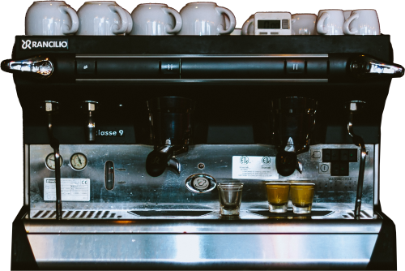

```js
const projects = FileAttachment('homepage/projects.json').json()
const links = FileAttachment('homepage/links.json').json()
const images = [
  // specify these so they get pulled into the build
  FileAttachment('assets/projects/automeme.png'),
  FileAttachment('assets/projects/beehive.png'),
  FileAttachment('assets/projects/calibrationcity.png'),
  FileAttachment('assets/projects/garden.png'),
  FileAttachment('assets/projects/nicenumbers.png'),
  FileAttachment('assets/projects/sandiego.png')
]
```

<style>
h1.hero {
  margin: 2rem 0;
  font-size: 3rem;
  background: linear-gradient(30deg, var(--theme-foreground-focus), currentColor);
  -webkit-background-clip: text;
  -webkit-text-fill-color: transparent;
  background-clip: text;
}

.card {
  margin: 0;
}
.gallery img {
  max-width: 100%;
  border-radius: 8px;
  box-shadow: 0 0 0 0.75px rgba(128, 128, 128, 0.2), 0 6px 12px 0 rgba(0, 0, 0, 0.2);
  aspect-ratio: 2500 / 1900;
}
.center {
  display: flex;
  text-align: center;
  align-items: center;
  justify-content: center;
}
</style>

<h1 class="hero">Hello, I'm wasabipesto.</h1>

I'm an engineer and also a human person.

## About me

I work in building construction as a controls engineer and project manager. I'm interested in thermodynamics, air quality, and building comfort in commercial and industrial settings.

I fiddle with computers, like the one serving you this webpage. I usually build things in python or rust and deploy them in docker. I believe in simplicity, and I believe in interpreting that term liberally.

I run a few tabletop games for my friends and family. I enjoy systems focusing on collaborative worldbuilding, genre-bending narratives, and interesting characters.

I believe in quantifying things when it's possible and helpful. I believe in trying and failing and learning.

---

## My projects

```js
var projects_html = []
for (const item of projects) {
  projects_html.push(
    html.fragment`
      <div class="card gallery">
        <a href="${item.link}" target="_blank">
          <h3>${item.name}</h3>
          <div>${item.description}</div>
          <p></p>
        </a>
      </div>`
  )
}
display(html`<div class="grid grid-cols-3">${projects_html}</div>`)
```

---

## Links

```js
const links_html = html`<table style="margin: 1rem">
  ${links.map(
    (item) =>
      html.fragment`<tr><td>${item.title}</td><td><a href="${item.link}" target="_blank">${item.link}</a></td></tr>`
  )}
</table>`
```

<div class="grid grid-cols-3">
  <div class="card center">
    <a href="https://applianceri.ng/next?host=wasabipesto.com" target="_blank">
      
    </a>
  </div>
  <div class="card grid-colspan-2">
    <div style="width: 95%;">${links_html}</div>
  </div>
</div>
