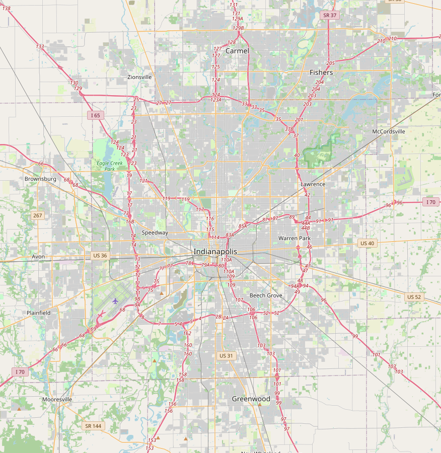
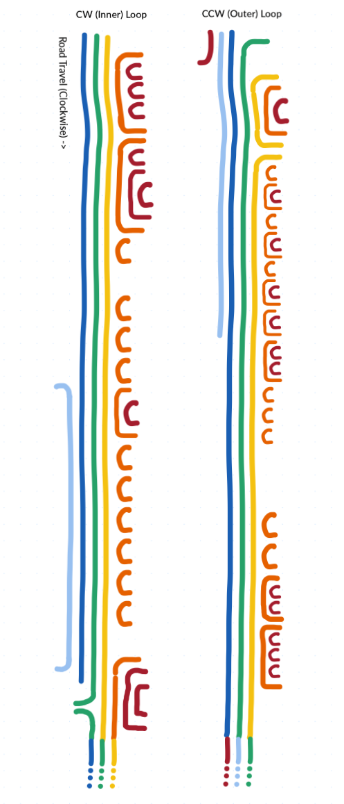
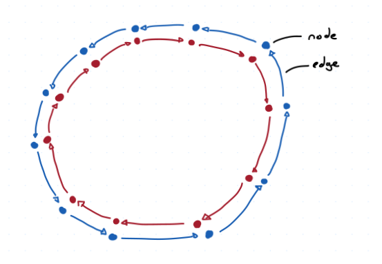
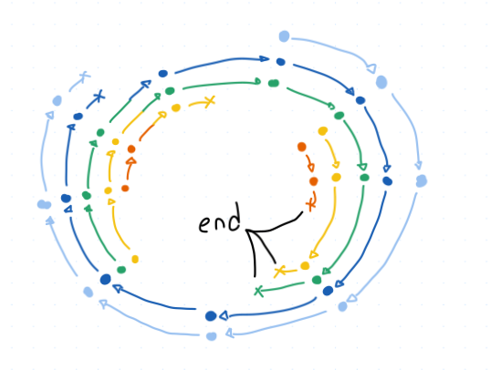
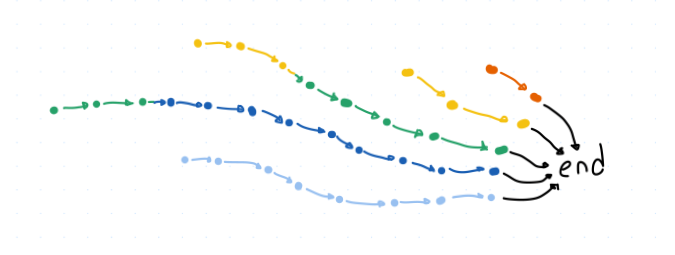
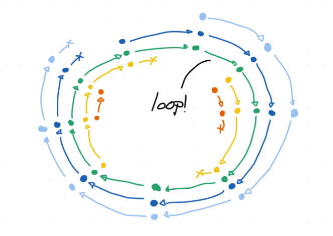

# You can drive a loop around I-465, twice

Indianapolis loves three things: roads, circles, and roads that are circles. We have the Indianapolis Motor Speedway, where people drive in a circle 500 times in a row, we have Carmel, the roundabout capital of the US, we have a huge monument in the middle of a roundabout in the direct middle of the city, and we have a very convenient beltway that surrounds the city called I-465. 

A great many commuters have spent a great many hours on I-465 and I count myself lucky to no longer be among them. But occasionally we'll have to go somewhere which takes us along the great wheel and I'll be reminded of some of the idle thoughts I had back when I was stuck in rush hour traffic, like "can you drive all the way around I-465 without changing lanes?"

For many beltways this is a pretty straightforward "yes". However, I-465 has just enough left-side exits that the answer could be "no" or "sometimes" or "maybe" or "only in one direction". But it should be pretty easy to just pick a lane and trace it out, right? 

## The rules

These were the rules I set when beginning the project:

1. I-465 is usually under construction (Indianapolis's 4th favorite thing). Right now the main piece of construction is along the I-69 north interchange. For this analysis we'll use the final plans for the road design after the construction is complete.
2. The driver may get on the road anywhere they wish and get to a specific position in any lane before they "begin the loop". 
3. Once the driver begins the loop, they must not cross a legal lane marker. If their lane ends and they are forced to merge into another lane, the loop ends. If their lane becomes an exit-only lane which forces them off I-465, the loop ends. If they encounter a fork, they can choose which lane to stay in.
4. The loop is complete when the driver reaches the same road position they were in when they began the loop. They may be in a different lane then they were in before, for example if the road happens to be a spiral.
5. For each of the clockwise (outer) and counter-clockwise (inner) roads, the path may loop once, multiple times, infinitely, or never. The longest possible path is the one that covers the most lateral distance from beginning to end, which may be infinite if there exists a true loop.

A few things ended up not mattering, such as the fork rule. All forks on I-465 result in one exiting lane and one continuing lane. Assuming our driver would choose the optimal route in those situations, we can ignore the exiting lane and count that as a continuing lane. That was the only rule where a driver could make a decision once they had begun the loop, so for I-465 all routes are fully deterministic. 

## Tracing it out

Like most grunt work I encounter, I tried outsourcing it first. I asked Claude if it could assemble a list of all lane operations over I-465 needed to answer the question as stated above but it just didn't have enough easily-accessible data to put it together. So I spent a few hours procrastinating some other stuff and walked around the loop via Google Maps, checking the satellite view against the street view and my own memory. For the construction areas I used plans from the INDOT site. 

I assembled a list of 136 lane events for both the clockwise and counter-clockwise roads, 38 of which didn't actually have any effect on the I-465 lanes at all. The remaining 98 included anything that introduced a new lane or removed one and included details like where, from which side, and amount of lanes added/removed. As we went around I verified the number of lanes present on I-465 to confirm none had been missed, and when we got to the starting point I confirmed that we had the same amount as we started with.

The simplest way to check for loops is to draw it out. I started drawing the same place I started counting, between I-865 and Michigan Street. I used different colors for each lane and added or removed them as I went along. Both sides (CW/CCW) had three lanes at my starting point, and if any of those three still remained unbroken by the end then that lane would be part of a loop. 

As it turns out, both sides have a loop! It doesn't matter if you're driving clockwise or counterclockwise, you'll be able to make at least one full loop without changing lanes.

At the bottom of that map you'll see the lane colors don't match up exactly with the next loop. This indicates that the lanes spiral, so you won't be able to drive around infinitely. However, you can get right around two laps with the following placements:

- Clockwise: Enter from 71st St in the right lane, survive about 2.1 laps, then end at I-865.
- Counterclockwise: Enter from 56th St in the right lane, survive about 1.9 laps, then end at I-865.

Neither is perfect, but you can get a little over 100 miles without ever using your turn signal.

## What if there was a far more complicated way to do this?

When you have a really big graph theory hammer, lots of things start to look like graph-shaped nails.

A road is a series of locations with continuous paths between them. If you liked graph theory a bit too much, you might say a road is a series of nodes with edges between them. If you were stuck in rush-hour traffic bored out of your mind, you might say that each lane on a road represents its own graph edge. If you were looking for something to get your mind off your present circumstances, you might begin to imagine all of I-465 as a huge graph, drifting in the sea of graph-space like an anemone.

Despite the name, graph theory doesn't have much to do with charts or graph paper. The gist of graph theory is that there's a type of system called a graph, and there's a bunch of fun tools you can use on a problem if you can boil it down to look like a graph. As long as you can represent your problem as things (nodes) and connections (edges), you can pretty much just plug your problem into a solver and get the answer. A lot of mathematics is just about how to make your really tricky problem look like a different tricky problem that someone else already solved and copying their homework. This is no different.

That being said, graphs get even easier to solve if they have some of these properties:

- There's a finite number of nodes and edges
- The edges have just one direction
- There is only one edge coming from each node
- There are few edges relative to nodes
- There are no cycles/loops in the graph

So let's take this problem and set it up as a graph, then see what tools we can use on it. 

We could set up intersections and interchanges as nodes, and the road between them as an edge. This would make two big loops, one for each direction of I-465. We know the edges flow in one direction, so that's nice, and since we're only looking at I-465 we can pretend there's only one edge coming from each node (just one slab of asphalt). But there's not much that we can do with that graph once we've constructed it.

Instead, let's try giving each lane its own node at each intersection. As our driver is traveling down the beltway they'll hit one of these points and keep driving along. That location is unique, if they were in a different lane than they'd be at a different node. And with the rule that they can't change lanes, they're stuck in that lane until it ends. They'll just continue until they hit the next interchange, where they'll still be in that lane if it exists. That means there's no crossovers between parallel nodes, just a single straight-ahead path at all times.

This is an example of a really convenient graph. It's called a functional graph, because you could imagine a function that takes any one location as an input and outputs the one single location you'll go to next. Since there are no forks on I-465, this fits perfectly. (If there were forks we could still do this, it would just be a little less clean.)

But what about when a car reaches the "end" of this graph? We don't represent the rest of the interstate highway system, or the many streets and avenues that you can access from I-465. However, there's nothing in the graph theory rulebook that says the nodes all have to be physical locations. We can just say that all cars that are disqualified (forced to exit or merge, for whatever reason) are instead moved to a special node called "the end". This makes it convenient to "grab" the graph by that one point and straighten out the curls into a line.

Now we can easily measure the length of each path, and see how long it is from start (when the lane was created) to finish (when it hits this ending node). This is an example of a directed acyclic graph, which just means that it flows in one direction (towards the end) and doesn't loop back on itself.

But what if it did loop back on itself? What would that look like?

Most people doing graph theory don't really want loops in their graph. It makes it harder to disentangle stuff and just generally makes things harder in most cases. So they have some special tools for determining if a graph has a cycle in it, and generally they are happier if it says "no". But for us, a cycle is a win! A cycle means you can loop around and around I-465 forever! In this situation the green loop would just sit outside the disentangled graph, floating free forever.

## Why would this ever be helpful?

You could imagine some much, much larger system with hundreds of lanes and thousands of interchanges across every city in the US. In such a system, a cycle in the graph would represent a loop around the country, where you could keep going forever and ever without ever reaching a point where you're forced to merge. Does such a route exist? Where? If there are multiple, what's the longest? Could you do a figure-eight between them? If there are none, what's the furthest you could go? At that scale it would probably be a little easier to handle this as a graph than drawing it out by hand, or even brute-forcing a solution.

If I had to write out a moral, it would be: Graph theory isn't special here. Become lightly acquainted with a broad number of fields like this and next time you have a problem, think about if you've seen that shape before. There's a good chance that someone else has already done your homework.
