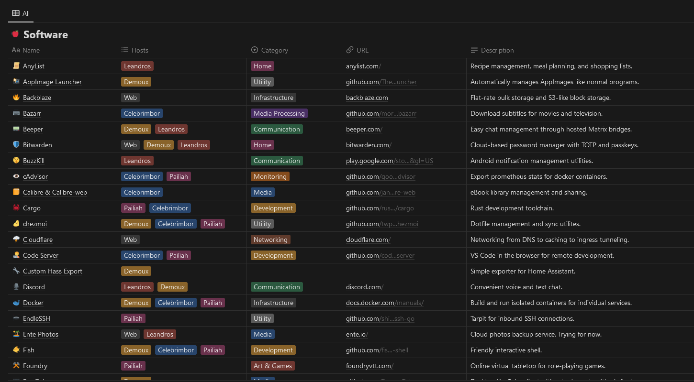

<h1 class="hero">Hello, I'm wasabipesto.</h1>

I'm an engineer and also a human person.

## About me

I work in building construction as a controls engineer and project manager. I'm interested in thermodynamics, air quality, and building comfort in commercial and industrial settings.

I fiddle with computers, like the one serving you this webpage. I usually build things in python or rust and deploy them in docker. I believe in simplicity, and I believe in interpreting that term liberally.

I run a few tabletop games for my friends and family. I enjoy systems focusing on collaborative worldbuilding, genre-bending narratives, and interesting characters.

I believe in quantifying things when it's possible and helpful. I believe in trying and failing and learning.

---

## My projects

  

  <a href="https://calibration.city/">
    <h3>Calibration City</h3>
    
Preciction market calibration and accuracy analysis.

    

  </a>
  

  

  <a href="https://nicenumbers.net/">
    <h3>Nice Numbers</h3>
    
The distributed search for square-cube pandigitals.

    

  </a>
  

  

  <a href="https://github.com/wasabipesto/beehive">
    <h3>Beehive</h3>
    
Visualizing data on this blog with Observable.

    

  </a>
  

  

  <a href="https://meme.limo/">
    <h3>Automeme</h3>
    
A reasonably-fast, reasonably-simple meme generation tool.

    

  </a>
  

  

  <a href="https://github.com/wasabipesto/sandiego">
    <h3>Sandiego</h3>
    
Reclaiming my personal data with nice graphs.

    

  </a>
  

  

  <a href="https://wasabipesto.com/notion">
    <h3>Garden</h3>
    
Offloading my brain into Notion.

    

  </a>
  

---

## Links

  

    
  

  

  

| what      | where                                                                                          |
| --------- | ---------------------------------------------------------------------------------------------- |
| github    | [github.com/wasabipesto](https://github.com/wasabipesto)                                       |
| tumblr    | [wasabipesto.tumblr.com](https://wasabipesto.tumblr.com)                                       |
| site rss  | [feed/rss.xml](/_file/assets/feed/rss.xml)                                                     |
| manifold  | [manifold.markets/wasabipesto](https://manifold.markets/wasabipesto)                           |
| ssh keys  | [api.github.com/users/wasabipesto/keys](https://api.github.com/users/wasabipesto/keys)         |
| gpg keys  | [api.github.com/users/wasabipesto/gpg_keys](https://api.github.com/users/wasabipesto/gpg_keys) |
| copyright | [CC BY-NC-SA 4.0 Deed](https://creativecommons.org/licenses/by-nc-sa/4.0/)                     |
| email     | [contact@wasabipesto.com](mailto://contact@wasabipesto.com)                                    |
| status    | [status.wasabipesto.com](https://status.wasabipesto.com/)                                      |

  

  

