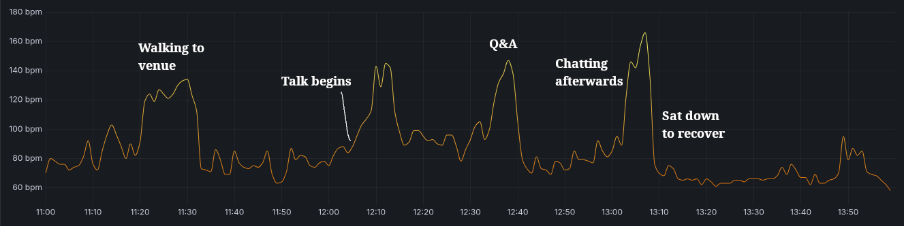

```js
const loc_history = FileAttachment('loc-history.json').json()
```

# Project Themis

These are my notes after finishing my most recent project, [Brier.fyi](https://brier.fyi). I won't be talking about the stuff on the site very much, just my mindset while making it.

## Version 1.0

I had built simple calibration plots for prediction markets before, but I wanted to try out some new stuff and make a web app. In July 2023 I made a simple prototype in Python with Flask that ran everything in memory. It was terrible and slow (10+ second load time) but it was fun to make.

## Version 2.0

In late 2023/early 2024, [Manifund](https://manifund.org/) ran an experiment using impact certificates as a way to test the mechanism. There was real money on the line, so I [submitted a few ideas](https://manifund.org/projects/wasabipestos-umbrella-project) and turned that cute little prototype into a full product that I thought was pretty cool, called Calibration City. The round was fun because there were a lot of people working on cool things, we got concrete feedback every month, and I got some money from a project that I would have done anyways.

Since I had to post updates by a deadline every month, I had a huge incentive to deploy cool new features as quickly as possible. I had never had deadlines like this so it was a little weird, but the feedback was very encouraging and I think it helped overall. It was certainly the most aggressive I had been about prioritizing new features and I think that was a good lesson to learn. By the end of the round I had made $3500 which was pretty great.

Overall I was pretty happy with how that project ended. I don’t normally work on projects for longer than 2-3 months, so this was a typical timeframe for me, but I got way more accomplished and made some money to boot. I didn’t do much with the project after that, some things behind the scenes started to break but the site still had a couple dozen regular users.

## Hiatus

My work was really busy around this time so I didn’t have the time or energy to go back and try to fix things when they broke. And since I had shipped everything without much regard for maintenance I would have to spend a fair amount of time to do it.

In September 2024 I was encouraged to apply for a [community grant round](https://manifund.org/projects/calibration-city). I had some ideas on what I could do next, but I knew I wouldn’t have much time to do huge changes. I mainly focused on making it a way for people to donate for what I had done so far. I ended up with around $3800 in funding with a lot of people excited about what I had planned but no concrete obligations. I sketched out how it would look and what I needed to do, but I didn’t have time to pick it up again until I got a new job in January.

## Version 3.0

My new job is fully remote and far lower stress. After doing basically nothing for a few months, I picked up Themis again in February and tried to figure out how to actually do what I envisioned.

Aside from the cool new features I wanted to add, I had some big problems with the existing site I wanted to address:

- The biggest thing that broke behind the scenes was the extract-transform-load data pipeline. It took a long time to run and failed often, which lead to me not refreshing the database for months at a time.
- Over time the site became slower and slower (I’m still not sure exactly why), plus it doesn’t always load correctly on the first visit. Caching doesn’t work quite right and so there was always a lot of load on the server.
- The old site was often cited without explanation or context, leaving visitors confused unless the person who linked it also gave an explanation. The primary chart looked neat, but didn’t really mean anything unless you already know about calibration. The Introduction page was supposed to be a remedy for that, but basically nobody read it.

And so I followed the siren song of a full rewrite.

- The data pipeline was already written in rust, but it deserialized every response immediately. Since several of the APIs had already changed significantly, I rewrote it to save the raw responses and deserialize after.
- The existing site had a lightweight Vue app that called an API that did all of the calculations for the plots. Since the data doesn’t change very often, I changed it to be a static site generated by Astro with the charts rendered at build time.
- With Astro I could add context and explanations in a way that was more intuitive, and with some more data I could answer frequently asked questions right up front.
- And with all of those improvements I was finally able to implement the cool new feature I had talked about six months prior.

You might read this and go “wow, that moron should have spent time up front making sure his shit was maintainable” and well, yeah, looking back you would be right. But for hobby projects where you’re only working on it for a few months and then maybe never coming back, I think prioritizing a cool feature over refactoring code is often a good choice.

You can see that project live at [Brier.fyi](https://brier.fyi).

## The Talk

This time around I gave myself a deadline. I signed up to give a talk about it at a mini-conference I would be attending. When I signed up to give the talk I knew it would force me to have something both complete an interesting to show off. I assumed that it would be done well in advance and give me plenty of time to make some slides, but it ended up being down to the wire. Some of the delay was from me adding some new features to the site at the last minute, some was due to beta users' feedback, and some was from me getting sucked into Baldur's Gate 3.

The talk forced me to explain everything from scratch, starting from zero knowledge, which was good. I found some gaps in my own data just by having to write everything out, which led to me crunching data in the hotel lobby the day before my slot. I ran through it with my wife in the hotel room the night before for practice, which had a mixed effect. It was good to practice and understand how long it would take me to say the whole thing out loud, but since I was trying not to be loud I couldn't be as confident and ended up stalling a lot.

The next morning I got there early, got everything set up, and launched right into the talk before most people had even arrived. This was the morning after a party, so there were quite a few people who were still sleeping it off. In the future I'd still do a 8-10AM slot, since I was still operating on Eastern time so that was more like noon to me. The talk itself ended up going great, I almost ran over time and I still had a lot of good questions afterwords. Honestly, the best part in my opinion was the time spent chatting with people who hung out after.



<figcaption>A plot of my heart rate over the course of the morning.</figcaption>

I ended up with a ton of great feedback and I really enjoyed giving the talk, so I considered that a good decision. I have decided, however, that my next project will not have a deadline.

### Commit History

```js
let loc_history_added = loc_history.filter((i) => i.added_or_removed == "added")
let loc_history_removed = loc_history.filter((i) => i.added_or_removed == "removed").map(
  (i) => Object.assign({}, i, {line_count: i.line_count * -1})
)
let loc_history_directional = [loc_history_added, loc_history_removed].flat()
```

```js
Plot.plot({
  caption: 'Lines of code added and removed from the repo for each commit.',
  height: 200,
  x: { type: 'utc', label: null },
  y: { grid: true, label: 'lines' },
  marks: [
    Plot.dot(loc_history_directional, {
      x: 'timestamp',
      y: 'line_count',
      channels: {
        message: 'commit_message'
      },
      tip: true
    }),
    Plot.ruleY([0])
  ]
})
```

```js
Plot.plot({
  caption: 'Lines of code added and removed per week.',
  height: 200,
  x: { type: 'utc', label: null },
  y: { grid: true, label: 'lines' },
  marks: [
    Plot.rectY(
      loc_history_added,
      Plot.binX(
        { y: 'sum' },
        {
          x: { interval: 'week', value: 'timestamp' },
          y: 'line_count'
        }
      )
    ),
    Plot.rectY(
      loc_history_removed,
      Plot.binX(
        { y: 'sum' },
        {
          x: { interval: 'week', value: 'timestamp' },
          y: 'line_count'
        }
      )
    ),
    Plot.ruleY([0])
  ]
})
```


# Lessons

I learn best by doing something wrong and then having to live with the consequences. What did I learn here?

## Grog Add Feature

Features are good! They are, presumably, why people are visiting/using your project. If I have the choice to ignore other components and focus solely on features in a hobby project, there are many cases where I can and do.

I implemented a “no deck chairs” rule - don’t rearrange deck chairs on the Titanic. If there’s any chance the code could be rewritten, don’t spend time prettifying or refactoring it. Throw in some comments, apologize to your future self, and move on. The only time I was allowed to refactor was if it was required to add a new feature.

## Extract, Transform, Load

I mentioned this above, but if you’re working with APIs that can change then separate out the (long-running, safe) download step from the (fast, but error-prone) extract step.

Storage space is cheap and you only need to keep the most recent run. If you have to wait on rate limits every time you change the extract schema, development stalls and you get frustrated. When you already have the raw response data, you can use a quick python script to explore the data and investigate quickly.

## Visualization

I have a few notes about data visualization.

First: when you are working with data, especially big data, visualize everything at every step. You will find issues or interesting things about your data and you will find them faster than through analytical methods. Just throw each stat into a quick histogram, look at individual outlier data points, see the overall shape of your data. If you are running transformations on the data, look at it before and after each step. Is it what you expected? Plot out the data for a random instance and see if it makes sense.

Second: I saw [this HN comment](https://news.ycombinator.com/item?id=43191703) on the ISBN visualization post:

> “I feel like visualizations of large datasets which are viewer-directed (i.e. they want you to "explore" the data instead of trying to tell you something specific about it or communicate a narrative) are often "pretty" but never particularly enlightening. I feel like that holds true for these in particular.”

I think the comment is a bit cynical (as per usual for HN) but they hit a good point here, which is that most users will just look at a visualization for a few seconds and move on.

- “Deep” visualizations like that one require a lot of engagement — people who take the time to explore can learn a lot, but most people don’t. I’ve seen personally that most users don’t change settings or click around, so show them the most important thing first.
- If you can clearly communicate your thesis in the first 10 seconds, the average user will have more specific questions and be more interested in clicking around to learn more. Even if they leave immediately you will have communicated much more clearly before they left.
- As the person working with the data, you probably know more about it than a random visitor. Share your insights with them! Point out the most important details and explain why they’re important. Context is super valuable.

Third: my overall flow for designing a new visualization is actually backwards.

1. First, figure out what single question you want to answer. Sketch out a chart that would answer that question unambiguously. Try several variations.
2. Create a mockup chart with dummy data, and put the dummy data in whatever format works best for the chart. Use a mock API or a static JSON file.
3. Then draw the rest of the owl. Build your data pipeline however you see fit, but make sure you conform to the dummy data schema. The less transformation you have to do at later steps, the happier you will be.

When I started on this rewrite, I built the final site first with plain JSON served though nginx to simulate the API. Basically every chart and table was designed before I had any data. There ended up being a few changes to that schema but it served as a good reference point for everything else. Then I went back and built the data layer, database schemas, and so on. Very highly recommend.

## An Astro Aside

Astro has a feature called content collections, which is [described as so](https://docs.astro.build/en/guides/content-collections/):

> Content collections are the best way to manage sets of content in any Astro project. Collections help to organize and query your documents, enable Intellisense and type checking in your editor, and provide automatic TypeScript type-safety for all of your content.

Astro [encourages you to use this in many cases](https://docs.astro.build/en/guides/content-collections/#when-to-create-a-collection):

> Define your data as a collection when: [...] You need to fetch (tens of) thousands of related pieces of data, and need a querying and caching method that handles at scale.

This sounded great for what I needed. I was downloading a small portion of the data I had saved, only around 5 gigs for now but soon to be around 10 gigs, and I wanted a way to keep that data in some sort of cache for quick reloads in preview mode. So I tried out the content collections.

First off, the Node environment that Astro runs in [has a memory limit](https://github.com/withastro/astro/issues/10485), which you will probably need to increase. I don’t know why it has one, but alas.

My assumption was that to cache this data, Astro would save each “collection” to some lightweight database like SQLite. It does not. It serializes all collections into a string — not strings for each collection, but a single string for all registered collections. “Okay, this should probably fine even if it’s not the most efficient,” you might think, if you didn’t know that Node has a maximum string length of **ONE GIGABYTE**.

So yes, Astro’s content collections are probably great, as long as you don’t have more than 1 GB of data. If you have more than that, check out [this issue](https://github.com/withastro/astro/issues/13649). I ended up writing my own very simple, very dumb caching layer which can actually handle data “at scale”.

## AI

I used a significant amount of LLM help for this project. At first it was just asking ChatGPT for advice, then asking it to write out some examples. I thought of it as a much better Google, able to find information about specific tools and techniques much quicker than it would have taken me alone.

I don’t know Javascript very well, so a lot of the time I would write some code myself and then copy it over to an LLM to peer-review and look for potential improvements. It was also great as a rubber duck or a second pair of eyes to see the forest while I'm in the trees.

Eventually [Zed](https://zed.dev/) (my editor of choice at the moment) came out with a new agent feature, so I took that for a spin. It was insane. I would copy over a section of my notes describing a planned feature and Claude would fully implement it better than I could. For someone like me, who wants to focus on the data and leave the site to someone else, this was a gamechanger. There's little use for me to learn all the intricacies and footguns if the framework *de jour* changes every six months.

I won't be using AI for everything, but when I'm in the "move fast and break things" mode it's hard to move faster than a machine. It won't be my first choice for anything that needs to be durable or I need to understand intimately, but it has significantly lowered the bar for potential projects.
